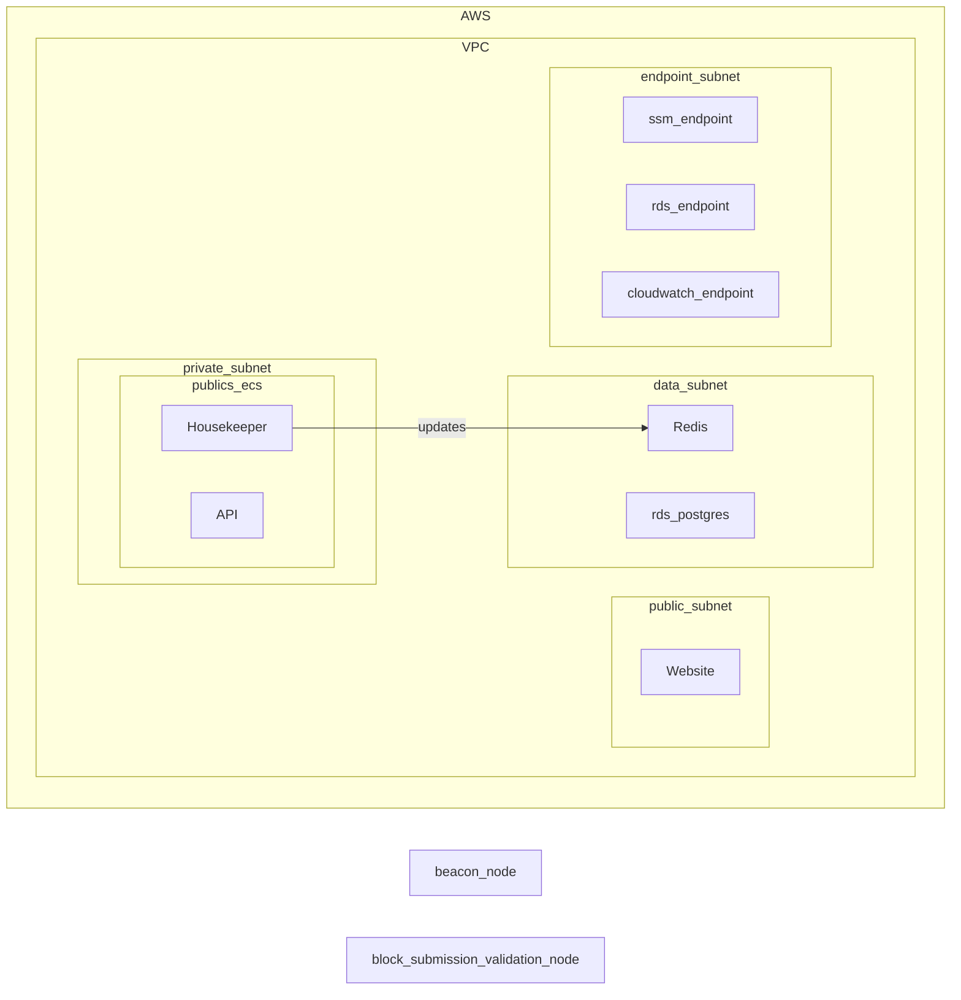

# Frontier Take Home DevOps task

This is an example task developed by Jon Duffy for the frontier take home assignment

It is meant to demonstrate usage of CDK and to demonstate DevOps skills in a time constrained environment

This is not production code

## Dependencies

* Typescript
* AWS CDK

## Installing CDK

See the guide [here](https://docs.aws.amazon.com/cdk/v2/guide/getting_started.html)

## Accessing AWS

You will need aws access and permission to be able to deploy CDK

Exactly how to do this will depend on the configuration of your AWS account.

i.e. is SSO in place?

## Bootstrapping an account 

To be able to deploy CDK, an acount must first be [bootstrapped](https://docs.aws.amazon.com/cdk/v2/guide/bootstrapping.html)

## Useful commands

* `cdk diff`        compare deployed stack with current state
* `cdk synth`       emits the synthesized CloudFormation template
* `cdk deploy`      deploy this stack to your default AWS account/region

### Other commands

* `npm run build`   compile typescript to js
* `npm run watch`   watch for changes and compile
* `npm run test`    perform the jest unit tests

## Artifacts deployed

### Roles

* API Role
* Housekeeper role
* Website role 

### Component Diagram

## Caveats & Considerations

* In an ideal deployment this would be setup as a multi account config with different environment
* Pipelines would deploy the stacks to each environment
* Currently all assets are in one file / CDK Stack
  * Networking, data, and application layers may not make sense to deploy as the same stack.
    * Networking for example may well be a shared resource
    * DNS is very likley to be a shared resource
* ECS fargate used for ease as docker K8's suggested in the docs, but this may not be ideal / cost effective 
* Unsure as to where ansible would be useful / effective
  * There are no AMI's to build
  * Container hardening would be performed in a production setup

## Next Steps 

### core unfinished pieces
* Port mappings
* Key and secret management
* Security Groups // IAM access
* Firewall (WAF)
* Setting the environment variables
* 

### Project Composition

* Folder / project config 
* Break out CDK stacks
* output variables, for other stacks / projects to reference

### Security 

* Ensure Security groups and NACL's are locked down appropirately 
* Ensure all IAM roles are least privilidge
* Ensure DB permissions are least privilidge
* Firewalls are appropriate 
* Alerting to appropriate channels i.e. slack
* * Securing containers and images using something like (dev-sec.io)[https://dev-sec.io/]
* pen testing (if new endpoints)
* Encryption
  * KMS keys used where required
  * all passwords in secrets manager
  * Keys and password are rotated 
* Perform a threat analysis
* WAF firewall

## Instance configuration
* As the go project is a monolith, may need to lock down each running container to ensure only the specified service runs

### Cost, Performance, Utilisation

* Ensure components are powerful enough to handle traffic / load / IO etc
* Ensure components are not under utilised, i.e. wasting money
* Is uneccessary networking traffic causing cost

### Networking
* Is all required access available
* Are all private services properly private / inaccessible?
* Are there an appropriate number of IP addresses available in the VPC's / subnets?

### Performance and scaling

* Can system scale up when required?
* Can system scale down without data loss?
* What should the triggers for scale up scale down be?

### redundancy / health

* health check on all ECS instances to ensure they are functioning correctly
* DB backups
  * Need to determine what is custom and not public or blockchain
* Test failover
  * Self healing 
  * Loss of data

### Build and deploy

* Build of services should be triggered on checkin
  * run tests
  * build secure new artifact (if on correct branch and tests have passed)
* Pipeline
  * Deploy to multiple environments
  * failing the pipeline on alarms and rolling back
  * a deployment strategy
  

### Monitoring and alerting

* Application Logging 
* Infra logging
* Dashboards
* Alerts and alarms

### Compliance

* Ensure all records required to be kept for legal and legislative reasons are persisted and immutable

### Account / Infra level

* Guard Duty
* Centralised logging 
* [Prowler](https://github.com/prowler-cloud/prowler)
* pen testing

### General

* Tagging
* Naming 
* Variablisation of naming string
  * i.e. changing by environment
  * see [Tagging](https://docs.aws.amazon.com/cdk/v2/guide/tagging.html)
* codeformatting
* * Coding standards / vairable naming
* Git hooks 
  * i.e. trigger formatting on push

## Reference

### Materials

[Running At Scale](https://flashbots.notion.site/Running-MEV-Boost-Relay-at-scale-4040ccd5186c425d9a860cbb29bbfe09)

### Imported libraries

L2 redis construct [cdk-redisdb(https://constructs.dev/packages/cdk-redisdb/v/0.0.25?lang=typescript)

Manual managment of the ECR repo [cdk-ecr-deployment](https://github.com/cdklabs/cdk-ecr-deployment)

### Project Setup

This [CDK](https://aws.amazon.com/cdk/) project was created with the command 

`cdk init --lanaguge typescript`

The `cdk.json` file tells the CDK Toolkit how to execute your app.

## Development notes 

* sepolia appears to require beacon to operate
* in ZSH the postgres string to run the go commands needs wrapping in quotes 
* website appears to be operational
* Go code appears monolithic, not broken out into seperate services
  * can build one container and run multiple instances of it for each service