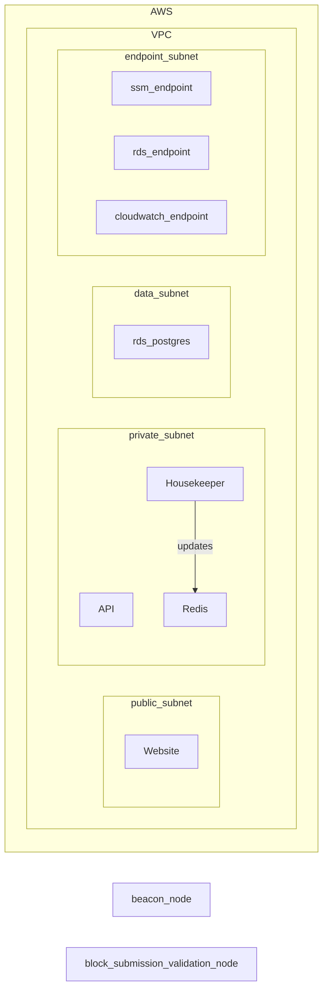

# Frontier Take Home DevOps task

This is an example task develop by Jon Duffy for the frontier take home assignment

It is meant to demonstrate usage of CDK and to demonstate DevOps skills in a time constrained environment

This is not production code

## Dependencies

* Typescript
* AWS CDK

## Installing CDK

See the guide [here](https://docs.aws.amazon.com/cdk/v2/guide/getting_started.html)

## Accessing AWS

You will need aws access and permission to be able to deploy CDK

Exactly how to do this will depend on the configuration of your AWS account.

i.e. is SSO in place?

## Bootstrapping an account 

To be able to deploy CDK, an acount must first be [bootstrapped](https://docs.aws.amazon.com/cdk/v2/guide/bootstrapping.html)

## Useful commands

* `cdk diff`        compare deployed stack with current state
* `cdk synth`       emits the synthesized CloudFormation template
* `cdk deploy`      deploy this stack to your default AWS account/region

### Other commands

* `npm run build`   compile typescript to js
* `npm run watch`   watch for changes and compile
* `npm run test`    perform the jest unit tests

## Artifacts deployed

### Roles

* API Role
* Housekeeper role
* Website role 

### Component Diagram

## Caveats & Considerations

* In an ideal deployment this would be setup as a multi account config with different environment
* Pipelines would deploy the stacks to each environment
* Networking, data, and application layers may not make sense to deploy as the same stack.
  * Networking for example may well be a shared resouce
  * DNS is very likley to be a shared resource

## Next Steps 

* Securing containers and images using something like (dev-sec.io)[https://dev-sec.io/]
* Build of services should be triggered on checkin
  * run test
  * build secure new artifact (if on correct branch and tests have passed)
* Application Logging 
* Infra logging
* Dashboards
* Alerts and alarms
* Pipeline
  * Deploy to multiple environments
  * failing the pipeline on alarms and rolling back
  * a deployment strategy
* Compliant tagging
* pen testing

### Account / Infra level

* Guard Duty
* Centralised logging 
* [Prowler](https://github.com/prowler-cloud/prowler)

## Reference

### Materials

[Running At Scale](https://flashbots.notion.site/Running-MEV-Boost-Relay-at-scale-4040ccd5186c425d9a860cbb29bbfe09)

### Imported libraries

L2 redis construct [cdk-redisdb(https://constructs.dev/packages/cdk-redisdb/v/0.0.25?lang=typescript)

Manual managment of the ECR repo [cdk-ecr-deployment](https://github.com/cdklabs/cdk-ecr-deployment)

### Project Setup

This [CDK](https://aws.amazon.com/cdk/) project was created with the command 

`cdk init --lanaguge typescript`

The `cdk.json` file tells the CDK Toolkit how to execute your app.

## Development notes 

* sepolia appears to require beacon to operate
* in ZSH the postgres string to run the go commands needs wrapping in quotes 
* website appears to be operational
* Go code appears monolithic, not broken out into seperate services
  * can build one container and run multiple instances of it for each service